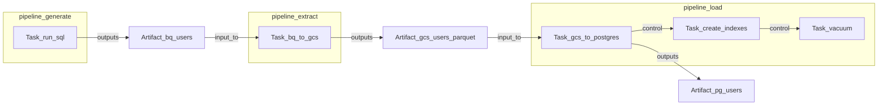

# Conductor Core Primitives

Design decisions for Conductor's orchestration model. Companion to competitor
notes in [`airflow.md`](airflow.md), [`dagster.md`](dagster.md),
[`prefect.md`](prefect.md), and [`temporal.md`](temporal.md).

## Goals

1. **Lineage / data graph** — see what produces what, across steps and across
   pipelines.
2. **Cascading recompute** — rematerializing upstream work marks downstream
   data-dependent work for rerun without manually clearing task instances
   (especially across pipeline boundaries).
3. **Automatic cross-team / cross-pipeline dependencies** — consumers declare
   the *data* they need, not another team's DAG/task IDs or bulkhead wait DAGs.
4. **Non-data work is first-class** — index, vacuum, notify, and similar ops
   are real work with ordering constraints, not fake data products.

## Decision

| Primitive | Role | Always present? |
|-----------|------|-----------------|
| **Task** | Runnable unit of work (later: WASM component) | Yes — sole execution primitive |
| **Artifact** | Named, addressable data product with identity + lineage | No — only when tracking a data product |
| **Pipeline** | Composed graph of tasks (schedule / package unit) | Yes — composition unit |
| **Effect** | Optional declaration of non-data mutation on a Task | No — metadata, not a fourth graph node |

**Inversion of Dagster:** assets are not nodes. Tasks are nodes. Artifacts are
ports and products of tasks.

```text
Dagster:     Asset is the node; Op is hidden underneath
Conductor:   Task is the node; Artifact is declared on the Task
```

Rejected alternative: dual first-class *runnable* graphs (Task graph + Asset
graph as peer node types). High confusion ("is vacuum a task or an asset?").

## Why Dagster's software-defined asset model exists

Airflow asks: "what jobs run, in what order?" Modern data teams ask: "what
data products exist, how are they built, and are they fresh?" Tools like dbt
already live in the second world. Nick Schrock's thesis is that **Big
Complexity** (teams, tools, deps) needs one canonical map of data products.

A software-defined asset bundles identity, compute recipe, upstream deps, and
materialization history. The orchestrator infers the execution graph from the
asset graph. Under the hood Dagster still runs ops; `@asset` is sugar. Making
the asset *primary* (not a tag on tasks) yields a **catalog of data**, global
lineage, and rematerialize-with-cascade across job boundaries.

| Dagster idea | Keep in Conductor? | As |
|--------------|--------------------|-----|
| Global data identity | Yes | `Artifact` |
| Lineage from deps | Yes | consume / produce |
| Cascade rematerialize | Yes | walk Artifact lineage → run producer Tasks |
| Materialization history / freshness | Yes (later) | events on Artifacts |
| Asset as the runnable / primary authoring noun | No | `Task` runs |
| Everything important must be an asset | No | effect Tasks without Artifacts |

**Punchline:** keep "orchestrate around durable data identity"; do not require
that identity to be the thing that runs.

## Task, Artifact, Pipeline

**Task** — always has identity and a compute body; may declare `inputs`,
`outputs`, control `after` deps, and optional `effects`.

**Artifact** — identity + address of a durable product (table, file, model).
Not runnable. Materializations are history events when a producing Task
succeeds. Postgres tables count (e.g. `postgres/app/users`).

**Pipeline** — named graph of Tasks. Edges are:

1. **Data edges** — derived from input/output of the same Artifact
2. **Control edges** — explicit `after` when there is no data product
   (load → index → vacuum)

Artifacts are global names and may link *across* pipelines. Pipelines are
packaging/scheduling units; lineage is not trapped inside one DAG file.

### When to use which edge

| Situation | Use |
|-----------|-----|
| B after A, same pipeline, no data product | `after=[A]` |
| B reads A's output (file/table/model) | `inputs` / `outputs` Artifacts |
| Rematerialize / freshness / cross-pipeline | Artifacts (required) |
| Maintenance, notify, vacuum, index | Task + optional effect; usually no new Artifact |

Artifacts are **not** required for ordering inside one pipeline. They **are**
required for lineage, cascade, and cross-pipeline contracts.

## Example: generate → extract → load → index → vacuum



```python
bq_users = Artifact("bigquery/analytics/users")
gcs_users = Artifact("gcs/analytics/users.parquet")
pg_users = Artifact("postgres/app/users")  # yes — also an Artifact

@task(outputs=[bq_users])
def run_sql(): ...

@task(inputs=[bq_users], outputs=[gcs_users])
def bq_to_gcs(): ...

@task(inputs=[gcs_users], outputs=[pg_users])
def gcs_to_postgres(): ...

@task(after=[gcs_to_postgres])  # control edge; no new Artifact
def create_indexes(): ...

@task(after=[create_indexes])
def vacuum(): ...

generate = Pipeline("generate", tasks=[run_sql])
extract = Pipeline("extract", tasks=[bq_to_gcs])
load = Pipeline("load", tasks=[gcs_to_postgres, create_indexes, vacuum])
```

Index/vacuum operate on the Postgres Artifact's backing store; they do not
become catalog entries like `users_vacuumed`.

## Cascading recompute

Cascade walks **Artifact lineage**, then runs Tasks that produce those
Artifacts (plus control-downstream Tasks in the same pipeline).

```python
conductor.rematerialize(bq_users)
# → run_sql → bq_to_gcs → gcs_to_postgres → create_indexes → vacuum
```

## Cross-team deps vs Airflow bulkhead DAGs

**Pain:** teams owned many DAGs; safe one-to-one cross-DAG waits were hard, so
orgs used gate DAGs that waited until *every* upstream team DAG finished.

**Cost:** over-waiting, coupling to job topology (DAG ids), coordination tax,
manual sensor lists, weak rematerialize across teams.

**Conductor default:** depend on published Artifacts, not Pipeline/Task ids:

```python
users = Artifact("warehouse/dp/users")  # team contract

@task(outputs=[users])
def build_users(): ...

@task(inputs=[users])  # not "wait for all of data_product"
def build_report(): ...
```

Coarse barriers ("B's window starts only after A's window closes") may still
exist later as an explicit product feature — not as the default because
fine-grained deps were impossible.

## UI lenses

| Lens | Role |
|------|------|
| **Artifact catalog (primary)** | Data products, lineage, freshness, rematerialize |
| **Pipeline view (secondary)** | Packaging and schedules |
| **Task / run view (secondary)** | Execution, failures, effects (vacuum, index) |

Primary surface is a **catalog of Artifacts**, not a list of Pipelines or
Tasks. Effect-only Tasks appear under related Artifact maintenance and in
run/pipeline views — not as sibling data-catalog entries.

## Authoring sugar (later)

Dagster-like `@artifact(...)` can compile down to Task + Artifact for pure
ETL. Vacuum stays a plain Task.

## Naming

| Concept | Public API | Internal (planner/runner) |
|---------|------------|---------------------------|
| Runnable | `Task` (named with a slug) | `TaskId` via `Interner` |
| Data identity | `Artifact::new("…")` | `ArtifactId` via `Interner` |
| Composition | `Pipeline` (named with a slug) | `PipelineId` via `Interner` |
| Non-data mutation | `Effect` (later) | — |

Users work with slugs and values (`Artifact`, `Task`, `Pipeline`). Dense ids and
the `Interner` are process-local implementation details for scheduling hot
paths — not part of the definition API.

## Non-goals (for the primitive itself)

- Scheduler, WASM runtime, and persistence layout details
- Full Effect type system on day one
- Temporal-style durable replay as the user-facing model
- Implementing UI in the core library crate
